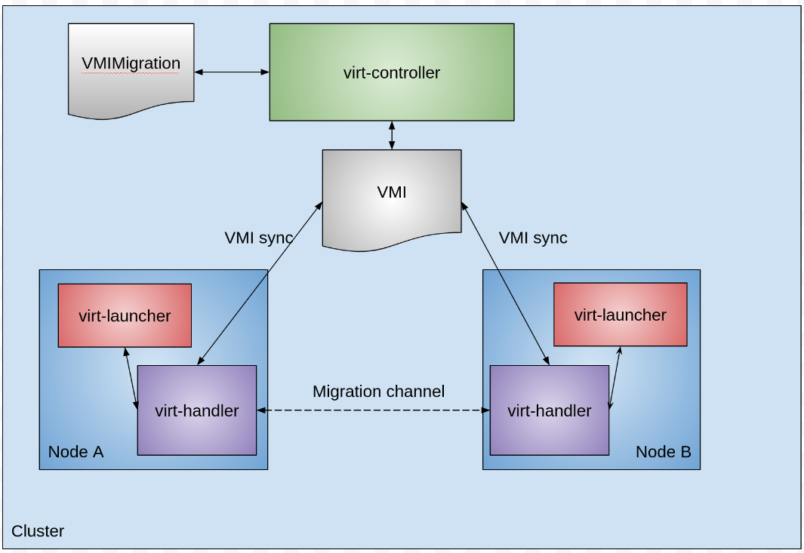
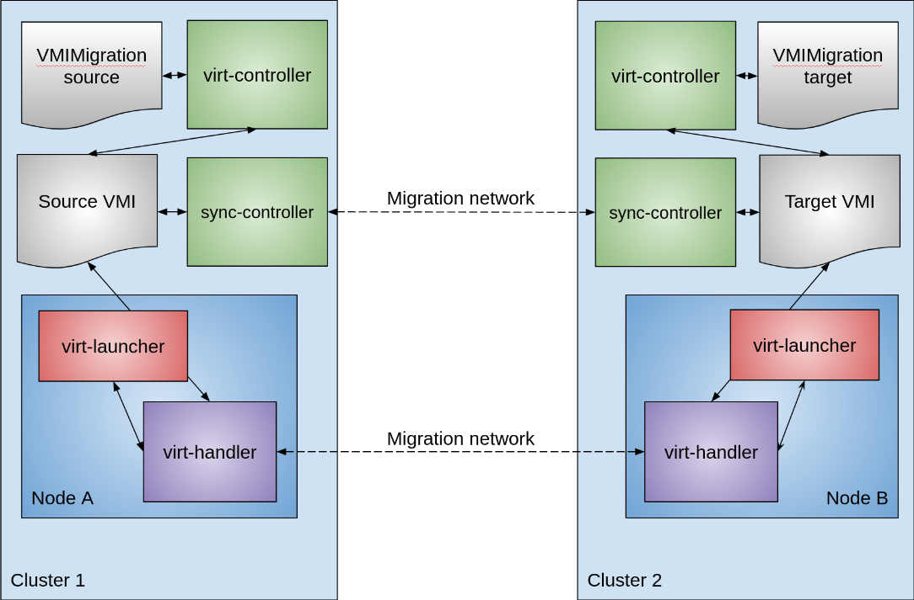

# Decentralized live migration

Decentralized live migration is a variation of [storage live migration](../storage/volume_migration.md) that allows you to migrate virtual machines between namespaces or even between different Kubernetes clusters. This can be useful for a variety of reasons including:

1. **Balancing Workload:** Distributing virtual machines between clusters helps optimize resource utilization. If one cluster is heavily loaded while another is idle, rebalancing can significantly improve operational efficiency.  
2. **Facilitating Maintenance:** For environments with multiple clusters, virtual machine migration allows for seamless maintenance. You can move virtual machines off a cluster slated for upgrades or shutdown, ensuring zero downtime for your services.
3. **Expediting Restores:** Instant restore capabilities from backup vendors, particularly when coupled with namespace migration, can drastically speed up recovery times. virtual machines can be quickly restored to a temporary location and then migrated to their original namespace and storage.

This document assumes the presence of an orchestrator for managing resource creation and removal. While future KubeVirt versions will incorporate an orchestrator for decentralized live migrations, the examples provided here detail the underlying steps an orchestrator would perform rather than utilizing one directly.

### Decentralized live migration Feature Gate

Decentralized live migration support must be enabled in the feature gates to be available. The [feature gates](../cluster_admin/activating_and_deactivating_feature_gates.md#how-to-activate-a-feature-gate)
field in the KubeVirt CR must be expanded by adding the `DecentralizedLiveMigration` to it.

## Architecture

**Compute live migrations**

Compute live migrations are characterized by a single `VirtualMachineInstance` resource and a single `VirtualMachineInstanceMigrations` resource. A migration is initiated by creating a `VirtualMachineInstanceMigration` resource, with coordination occurring via the VirtualMachineInstance's status, as shown in Figure 1.

Figure 1:


**Storage live migrations**

Storage live migrations, a variation of compute live migrations, involve copying the virtual machine's state and disk contents over the migration network. More information on initiating a storage live migration can be found in this [document](https://kubevirt.io/user-guide/storage/volume_migration/).

**Decentralized live migrations**

Decentralized live migrations are a variation of storage live migrations. They involve two `VirtualMachineInstances` and two `VirtualMachineInstanceMigrations`. Similar to storage live migrations, disk contents are copied over the network to the receiving virtual machine. However, the key difference is that the receiving virtual machine has a completely separate `VirtualMachineInstance`. In order to coordinate the migration, the status of the source and target 'VirtualMachineInstances` have to be synchronized, as illustrated in Figure 2.

Figure 2:


A dedicated synchronization controller facilitates communication between the source and target `VirtualMachineInstances`, as depicted in Figure 2. This design enables the reuse of most existing live migration mechanisms developed for `compute` migrations.

## Required resources

To migrate a virtual machine between namespaces or clusters, you must create both a target `VirtualMachine` resource and a target `VirtualMachineInstanceMigration` resource. A decentralized live migration cannot be achieved using only a `VirtualMachineInstance` resource.

The target cluster/namespace must possess all necessary resources for the virtual machine to operate. Some resources may not be an exact match on the target. For example, the storage class available on the target might differ from the source. Since decentralized live migration is a type of storage live migration, it is possible to change the storage class on the target and successfully complete the migration. The same applies to networking, though connectivity may be disrupted depending on the network configuration.

Additionally, auxiliary resources, such as a `Secret` containing an SSH key or a `ConfigMap` with configuration data, must also be copied and made available on the target cluster.

## Target virtual machine

In order to construct the target `VirtualMachine` resource, it makes sense to take the bulk of the source `VirtualMachine` resource fields, but replace the network and disk(s) to match what is available on the target cluster/namespace. The `runStrategy` must be set to `WaitAsReceiver`, signaling to KubeVirt that this is a special target virtual machine and that standard virtual machine commands (start/stop) will not function until the migration is completed. Consider the following source virtual machine running on Cluster 1.

Source Virtual Machine:

```yaml
apiVersion: kubevirt.io/v1
kind: VirtualMachine
metadata:
  name: example-decentralized-lm-vm
spec:
  runStrategy: Always
  template:
    metadata:
  	  creationTimestamp: null
    spec:
  	  architecture: amd64
  	  domain:
    	    devices:
    	    autoattachGraphicsDevice: false
    	  disks:
    	  - disk:
             bus: virtio
      	    name: disk0
    	  interfaces:
    	  - masquerade: {}
      	    name: default
    	  machine:
      	    type: q35
    	  resources:
      	    requests:
             memory: 128Mi
    networks:
    - name: default
  	  pod: {}
    volumes:
  	  - dataVolume:
      	    name: example-decentralized-lm-vm-dv
    	  name: disk0
```

A `VirtualMachine` named 'example-decentralized-lm-vm' is created, utilizing a `DataVolume` named 'example-decentralized-lm-vm-dv'. This `DataVolume` can contain any kind of disk image, for example fedora. Due to the `runStrategy` being set to `Always`, the virtual machine will always start once the YAML is applied to the cluster.

Within the target cluster, all necessary resources must be available to deploy the target virtual machine. To hold the contents of the source disk, a blank `DataVolume` is created. While not mandatory, it is advisable to retain the original name.

Target DataVolume:

```yaml
apiVersion: cdi.kubevirt.io/v1beta1
kind: DataVolume
metadata:
  annotations:
	cdi.kubevirt.io/storage.usePopulator: "true"
  name: example-decentralized-lm-vm-dv
spec:
  source:
	blank: {}
  storage:
    storageClassName: <other storage class>
    resources:
      requests:
        storage: 10Gi
```

Target Virtual Machine:

```yaml
apiVersion: kubevirt.io/v1
kind: VirtualMachine
metadata:
  annotations:
	kubevirt.io/restore-run-strategy: Always
  name: example-decentralized-lm-vm
spec:
  runStrategy: WaitAsReceiver
  template:
	metadata:
  	  creationTimestamp: null
	spec:
  	  architecture: amd64
  	  domain:
    	    devices:
    	    autoattachGraphicsDevice: false
    	  disks:
    	  - disk:
             bus: virtio
      	    name: disk0
    	  interfaces:
    	  - masquerade: {}
      	    name: default
    	  machine:
      	    type: q35
    	  resources:
      	    requests:
             memory: 128Mi
	networks:
	- name: default
  	  pod: {}
	volumes:
  	  - dataVolume:
      	    name: example-decentralized-lm-vm-dv
    	  name: disk0
```

The source and target virtual machine definitions differ in two key aspects:

* The target's `runStrategy` is set to `WaitAsReceiver`.
* The target virtual machine includes an annotation specifying the `runStrategy` after migration, which should be the same as the source, in this case it is `Always`.

Any additional resources beyond the virtual machine disk, such as `Secret`s or `Configmap`s, must also be created on the target cluster. Upon creation of the `VirtualMachine` resource, KubeVirt will generate a corresponding receiving `VirtualMachineInstace`, which can then be referenced in the target migration resource.

## Migration resources

Once the target virtual machine has been created, in order to start the migration you need to create a 'source' and a 'target' `VirtualMachineInstanceMigration`. After both the source and target migration resources have been created the migration will commence.

### Target migration resource

A target migration resource closely resembles a standard `VirtualMachineInstanceMigration` resource, with the addition of fields that designate it as a receiving decentralized live migration resource.

```yaml
apiVersion: kubevirt.io/v1
kind: VirtualMachineInstanceMigration
metadata:
  name: example-target-migration
  namespace: <same namespace as target vm>
spec:
  receive:
	migrationID: <unique identifier>
  vmiName: <name of the vmi that is created from target vm>
```

The `receive` field designates this as a target resource for decentralized migration. The `migrationID` string, uniquely identifies the 'source' and 'target' `VirtualMachineInstanceMigrations`. The `vmiName` then maps the `migrationID` to the appropriate `VirtualMachineInstance`

### Source migration resource

The source migration resource now includes an additional field with two sub-fields:

1. `migrationID` (identical to the target migration resource) 
2. `connectURL`. This connection URL is used to connect to the synchronization controller on the target cluster. 

There are two methods to acquire the synchronization controller's address:

1. **Accessing the KubeVirt CR on the Target Cluster:** If you have access to the KubeVirt CR, a new field named `synchronizationAddresses` will provide a list of address/port combinations for the `connectURL`.  
2. **After Target Migration Resource Creation:** If you lack KubeVirt CR access, once the target migration resource is created, its status will contain a `synchronizationAddresses` field with the same list of address/port combinations.

The key distinction between these options is that Method 1 allows you to obtain the connection URL in advance, enabling the creation of the source migration resource simultaneously with or prior to the target migration resource.

Once the connection URL is acquired, its value should be placed in the `connectURL` field of the source migration resource.

```yaml
apiVersion: kubevirt.io/v1
kind: VirtualMachineInstanceMigration
metadata:
  name: example-source-migration
spec:
  sendTo:
	connectURL: "<synchronization address>"
	migrationID: <unique identifier, same as target migration resource migrationID>
  vmiName: <name of the source vmi>
```

## Configuring KubeVirt CA with cross cluster live migration

When migrating between two clusters, each cluster will have its own installation of KubeVirt. Each KubeVirt installation will create and use its own Certificate Authority (CA). This CA is used to secure communication between the synchronization controllers and the virt-handlers during migration. For each cluster to trust the other cluster, the public CA keys must be exchanged between the clusters.

The public CA key is stored in a `ConfigMap` in the namespace where KubeVirt is installed (defaults to `kubevirt`). This `ConfigMap` is named `kubevirt-ca`. The following is an example of this `ConfigMap`:

```yaml
apiVersion: v1
data:
  ca-bundle: |
    -----BEGIN CERTIFICATE-----
...
    -----END CERTIFICATE-----
    -----BEGIN CERTIFICATE-----
...
    -----END CERTIFICATE-----
kind: ConfigMap
metadata:
  name: kubevirt-ca
  namespace: kubevirt
```

In the same namespace, there will be another `ConfigMap` named `kubevirt-external-ca` which will have a `ca-bundle` field as part of its data. In order for Cluster1 to trust the CA from Cluster2, take the ca-bundle from Cluster2's `kubevirt-ca` `ConfigMap` and copy the `ca-bundle` into Cluster1's `kubevirt-external-ca` and vice versa. After you update the `kubevirt-external-ca`, it will automatically clear out the contents of the `kubevirt-external-ca` but copy the contents into the `kubevirt-ca` `ConfigMap`. It will remove invalid, duplicate and expired keys before doing so.

Depending on how long the keys are valid you will have to do this process again once the keys expire. By default a KubeVirt CA is valid for 2 days

## Cancelling decentralized live migration

To cancel an active decentralized live migration, delete the corresponding migration resources from both the source and target cluster/namespace. This action signals KubeVirt to cancel the migration. The cancellation process for decentralized live migrations operates under the same principles as standard migration cancellations. There may be a short delay during which the migration could potentially finish, at which point cancelling has no affect.

## Migration failure

Unlike standard live migrations that automatically retry until completion, failed decentralized live migrations do not. When a decentralized live migration fails, the source virtual machine continues to run on the source, and the target virtual machine enters a failed state. To reattempt the migration, you must manually delete both the source and target `VirtualMachineInstanceMigration` resources, as well as the target virtual machine.

## Limitations

Since decentralized live migration is a variation of storage live migration it has the same limitations:

* Shareable disks are not supported, as we cannot guarantee data consistency with multiple writers.  
* [`filesystem` devices](../storage/disks_and_volumes.md/#filesystems) are not supported, as virtio-fs does not currently support live migration.
* [LUN disks](../storage/disks_and_volumes.md/#lun) are not supported, as we cannot guarantee that the target is also a LUN when migrating.
* VM state PVC is RWX on both source and target. Due to a [bug](https://issues.redhat.com/browse/RHEL-108915) it will not copy the vTPM device data, because it is assumed that having shared storage on both source and target is the same storage.
