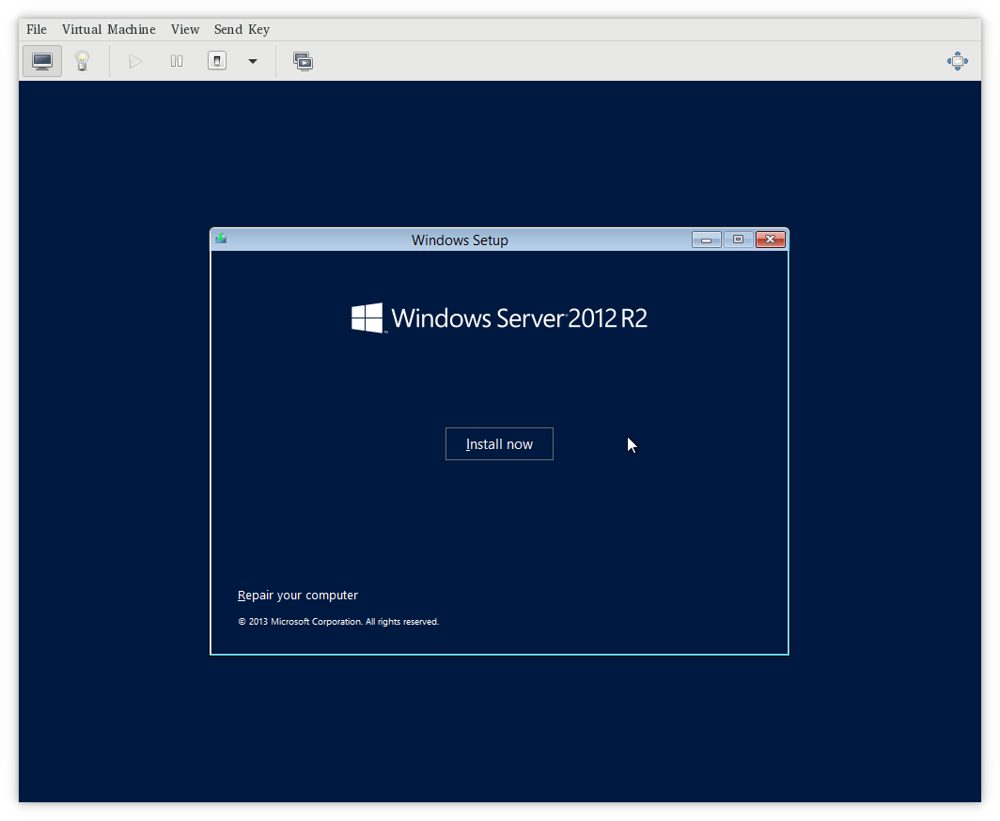
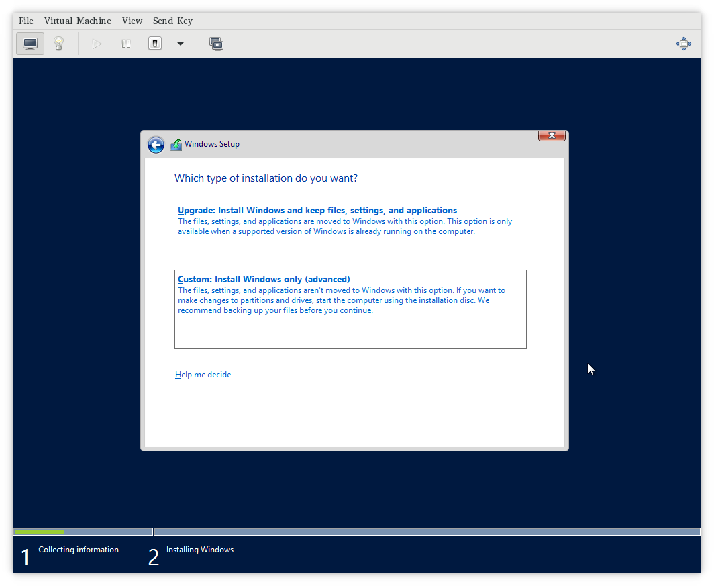
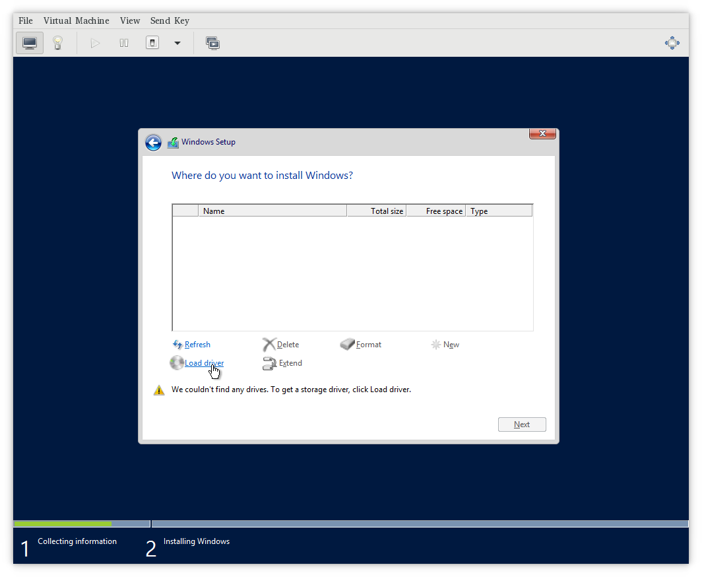
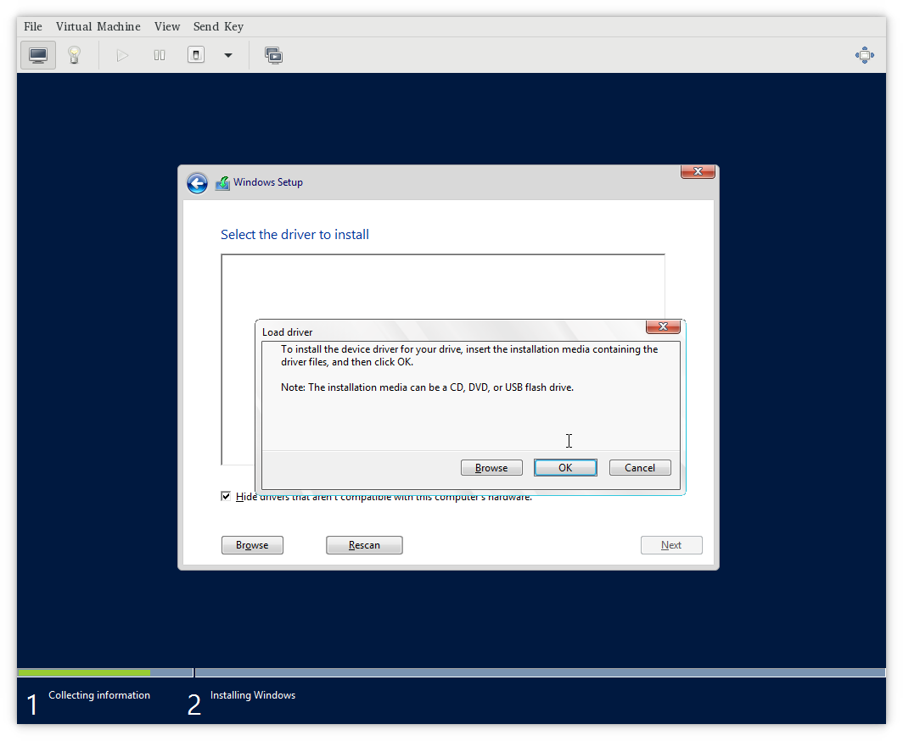
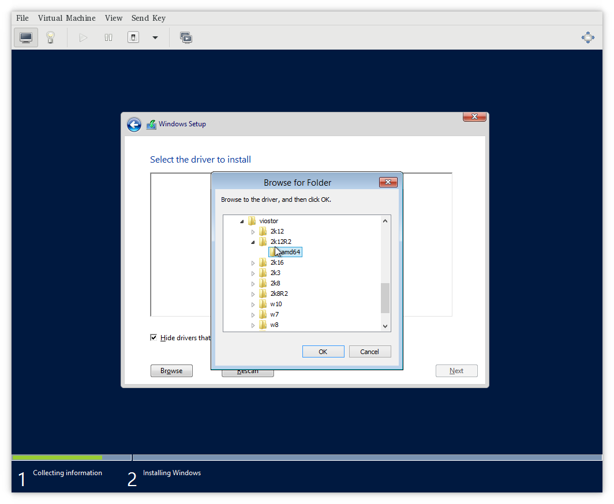
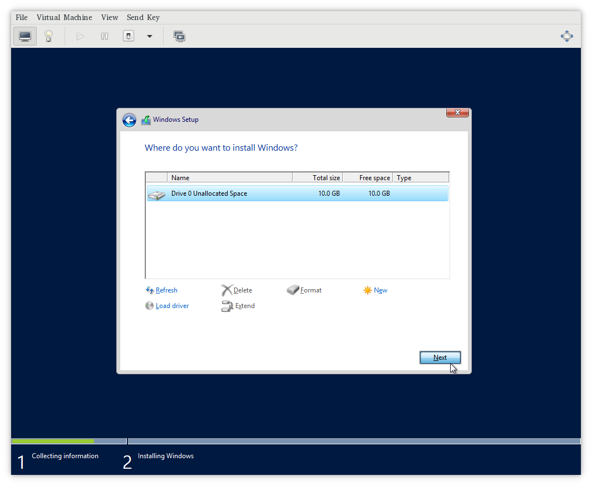
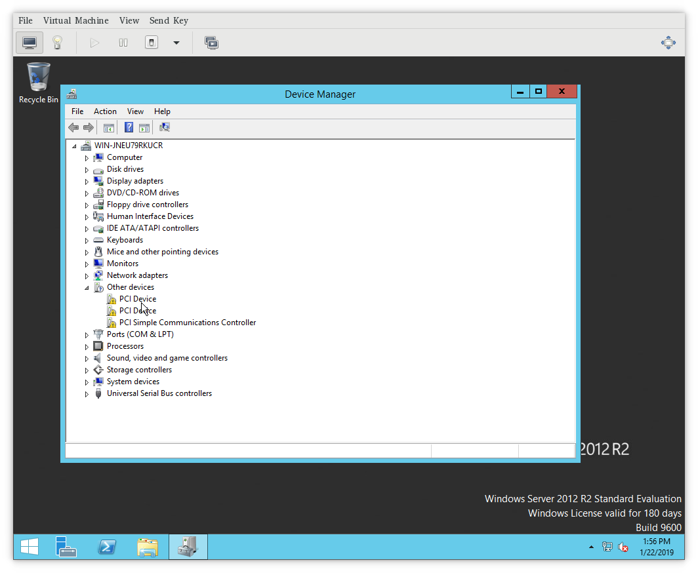
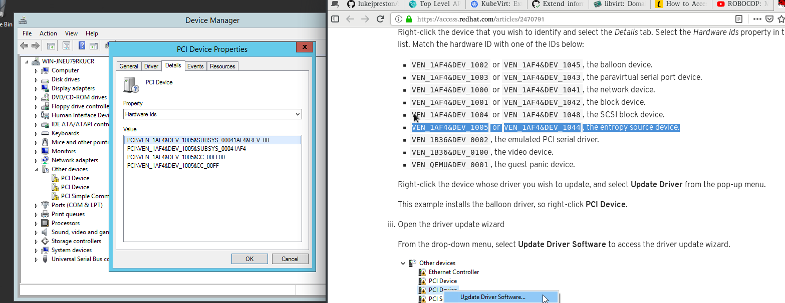
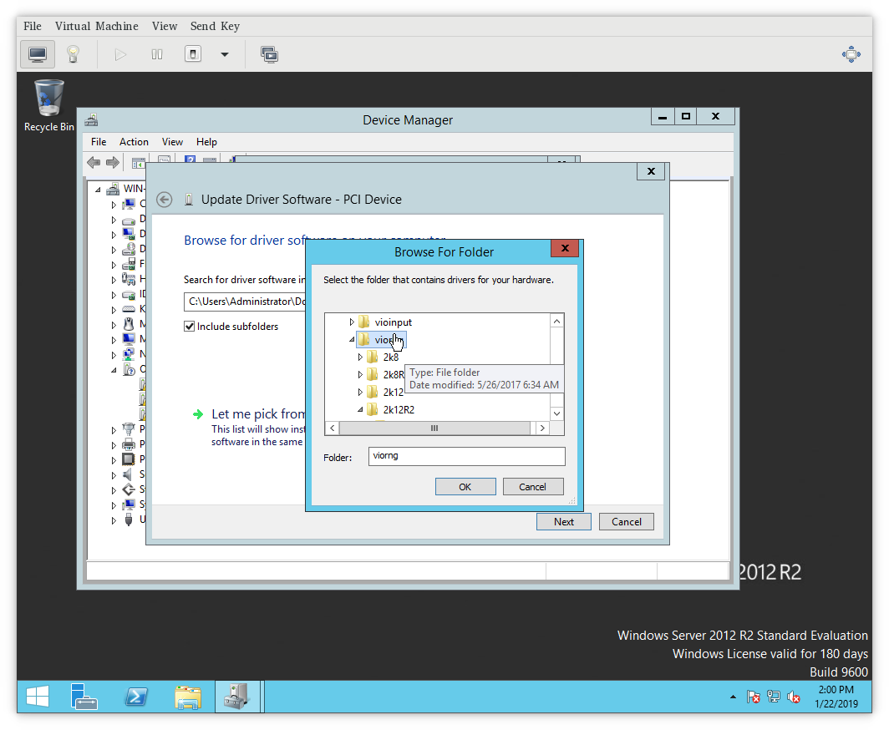
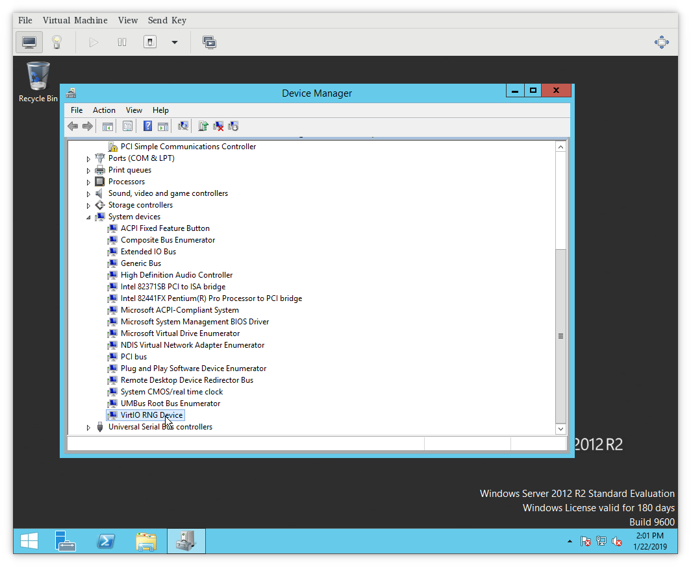

# Windows virtio drivers

Purpose of this document is to explain how to install virtio drivers for
Microsoft Windows running in a fully virtualized guest.

## Do I need virtio drivers?

Yes. Without the virtio drivers, you cannot use
[paravirtualized](https://access.redhat.com/documentation/en-us/red_hat_enterprise_linux/7/html/virtualization_getting_started_guide/sec-virtualization_getting_started-products-virtualized-hardware-devices#sec-Virtualization_Getting_Started-Products-paravirtdevices)
hardware properly. It would either not work, or will have a severe
performance penalty.

For more details on configuring your guest please refer to [Guest
Virtual Machine Device
Configuration](https://access.redhat.com/documentation/en-us/red_hat_enterprise_linux/7/html/virtualization_deployment_and_administration_guide/chap-guest_virtual_machine_device_configuration).

## Which drivers I need to install?

There are usually up to 8 possible devices that are required to run
Windows smoothly in a virtualized environment. KubeVirt currently
supports only:

-   **viostor**, the block driver, applies to SCSI Controller in the
    Other devices group.

-   **viorng**, the entropy source driver, applies to PCI Device in the
    Other devices group.

-   **NetKVM**, the network driver, applies to Ethernet Controller in
    the Other devices group. Available only if a virtio NIC is
    configured.

Other virtio drivers, that exists and might be supported in the future:

-   Balloon, the balloon driver, applies to PCI Device in the Other
    devices group

-   vioserial, the paravirtual serial driver, applies to PCI Simple
    Communications Controller in the Other devices group.

-   vioscsi, the SCSI block driver, applies to SCSI Controller in the
    Other devices group.

-   qemupciserial, the emulated PCI serial driver, applies to PCI Serial
    Port in the Other devices group.

-   qxl, the paravirtual video driver, applied to Microsoft Basic
    Display Adapter in the Display adapters group.

-   pvpanic, the paravirtual panic driver, applies to Unknown device in
    the Other devices group.

> **Note**
>
> Some drivers are required in the installation phase. When you are
> installing Windows onto the virtio block storage you have to provide
> an appropriate virtio driver. Namely, choose viostor driver for your
> version of Microsoft Windows, eg. does not install XP driver when you
> run Windows 10.
>
> Other drivers can be installed after the successful windows
> installation. Again, please install only drivers matching your Windows
> version.

### How to install during Windows install?

To install drivers before the Windows starts its install, make sure you
have virtio-win package attached to your VirtualMachine as SATA CD-ROM.
In the Windows installation, choose advanced install and load driver.
Then please navigate to loaded Virtio CD-ROM and install one of viostor
or vioscsi, depending on whichever you have set up.

Step by step screenshots:

### How to install after Windows install?

After windows install, please go to [Device
Manager](https://support.microsoft.com/en-us/help/4026149/windows-open-device-manager).
There you should see undetected devices in "available devices" section.
You can install virtio drivers one by one going through this list.

For more details on how to choose a proper driver and how to install the
driver, please refer to the [Windows Guest Virtual Machines on Red Hat
Enterprise Linux 7](https://access.redhat.com/articles/2470791).

## How to obtain virtio drivers?

The virtio Windows drivers are distributed in a form of
[containerDisk](https://kubevirt.io/user-guide/docs/latest/creating-virtual-machines/disks-and-volumes.html#containerDisk),
which can be simply mounted to the VirtualMachine. The container image,
containing the disk is located at:
<https://hub.docker.com/r/kubevirt/virtio-container-disk> and the image
be pulled as any other docker container:

    docker pull kubevirt/virtio-container-disk

However, pulling image manually is not required, it will be downloaded
if not present by Kubernetes when deploying VirtualMachine.

## Attaching to VirtualMachine

KubeVirt distributes virtio drivers for Microsoft Windows in a form of
container disk. The package contains the virtio drivers and QEMU guest
agent. The disk was tested on Microsoft Windows Server 2012. Supported
Windows version is XP and up.

The package is intended to be used as CD-ROM attached to the virtual
machine with Microsoft Windows. It can be used as SATA CDROM during
install phase or to provide drivers in an existing Windows installation.

Attaching the virtio-win package can be done simply by adding
ContainerDisk to you VirtualMachine.

    spec:
      domain:
        devices:
          disks:
            - name: virtiocontainerdisk
              # Any other disk you want to use, must go before virtioContainerDisk.
              # KubeVirt boots from disks in order ther are defined.
              # Therefore virtioContainerDisk, must be after bootable disk.
              # Other option is to choose boot order explicitly:
              #  - https://kubevirt.io/api-reference/v0.13.2/definitions.html#_v1_disk
              # NOTE: You either specify bootOrder explicitely or sort the items in
              #       disks. You can not do both at the same time.
              # bootOrder: 2
              cdrom:
                bus: sata
    volumes:
      - containerDisk:
          image: kubevirt/virtio-container-disk
        name: virtiocontainerdisk

Once you are done installing virtio drivers, you can remove virtio
container disk by simply removing the disk from yaml specification and
restarting the VirtualMachine.
