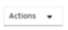

# Web Console

!!! Note
    By deploying KubeVirt on top of OpenShift the user can benefit from the [OpenShift web console](https://docs.openshift.com/container-platform/4.10/web_console/web-console.html) functionality.

## Managing Virtual Machines

### Creating a Virtual Machine with the Interactive Wizard

The web console features an interactive wizard that guides you through
[**Basic Settings**](#virtual-machine-wizard-fields),
[**Networking**](#networking-fields), and
[**Storage**](#storage-fields) screens to simplify the
process of creating virtual machines. All required fields are marked
with a `*`. The wizard prevents you from moving to the next screen until
the required fields have been completed.

NICs and storage disks can be created and attached to virtual machines
after they have been created.

****Bootable Disk**.**

If either `URL` or `Container` are selected as the **Provision Source**
in the [**Basic Settings**](#virtual-machine-wizard-fields) screen, a `rootdisk`
disk is created and attached to the virtual machine as the **Bootable
Disk**. You can modify the `rootdisk` but you cannot remove it.

A **Bootable Disk** is not required for virtual machines provisioned
from a **PXE** source if there are no disks attached to the virtual
machine. If one or more disks are attached to the virtual machine, you
must select one as the **Bootable Disk**.

1.  Click **Workloads** > **Virtual Machines** from the side menu.

2.  Click **Create Virtual Machine** and select **Create with Wizard**.

3.  Fill in all required [**Basic Settings**](#virtual-machine-wizard-fields).
    Selecting a **Template** automatically fills in these fields.

4.  Click **Next** to progress to the
    [**Networking**](#networking-fields) screen. A `nic0` NIC
    is attached by default.

    1.  (Optional) Click **Create NIC** to create additional NICs.

    2.  (Optional) You can remove any or all NICs by clicking the 
        button and selecting **Remove NIC**. A virtual machine does not
        need a NIC attached to be created. NICs can be
        [created](#creating-a-nic-for-a-virtual-machine) after the virtual machine has been
        created.

5.  Click **Next** to progress to the
    [**Storage**](#storage-fields) screen.

    1.  (Optional) Click **Create Disk** to create additional disks.
        These disks can be removed by clicking the  button and
        selecting **Remove Disk**.

    2.  (Optional) Click on a disk to modify available fields. Click the
         button to save the update.

    3.  (Optional) Click **Attach Disk** to choose an available disk
        from the **Select Storage** drop-down list.

6.  Click **Create Virtual Machine &gt;**. The **Results** screen
    displays the JSON configuration file for the virtual machine.

The virtual machine should now be listed in **Workloads** > **Virtual
Machines**.

### Creating a Virtual Machine Using a YAML Configuration File

A virtual machine can also be created by writing or pasting a YAML
configuration file in the web console in the **Workloads** > **Virtual
Machines** screen. A valid `example` virtual machine configuration is
provided by default whenever you open the YAML edit screen.

If your YAML configuration is invalid when you click **Create**, an
error message indicates the parameter in which the error occurs. Only
one error is shown at a time.

> Note: Navigating away from the YAML screen while editing cancels any
> changes to the configuration you have made.

1.  Click **Workloads** > **Virtual Machines** from the side menu.

2.  Click **Create Virtual Machine** and select **Create from YAML**.

3.  Write or paste your virtual machine configuration in the editable
    window.

    1.  Alternatively, use the `example` virtual machine provided by
        default in the YAML screen.

4.  (Optional) Click **Download** to download the YAML configuration
    file to your local machine in its present state.

5.  Click **Create** to create the virtual machine.

The virtual machine should now be listed in **Workloads** > **Virtual
Machines**.

### Editing a Virtual Machine

You can edit some values of a virtual machine in the web console, either
by editing the [YAML directly](#editing-the-yaml-of-a-virtual-machine), or from the
**Virtual Machine Overview** screen.

When editing from the **Virtual Machine Overview** screen, the virtual
machine must be **Off**.

1.  Click **Workloads** > **Virtual Machines** from the side menu.

2.  Select a Virtual Machine.

3.  Click **Edit** to make editable fields available.

4.  You can change the **Flavor**, but only to **Custom**, which
    provides additional fields for **CPU** and **Memory**.

5.  Click **Save**.

The updated values are shown after the operation is processed.

### Editing the YAML of a Virtual Machine

You can edit the YAML configuration of a virtual machine directly within
the web console.

Not all parameters can be updated. If you edit values that cannot be
changed and click **Save**, an error message indicates the parameter
that was not able to be updated.

The YAML configuration can be edited while the virtual machine is
**Running**, however the changes will only take effect after the virtual
machine has been restarted.

> Note: Navigating away from the YAML screen while editing cancels any
> changes to the configuration you have made.

1.  Click **Workloads** > **Virtual Machine** from the side menu.

2.  Select a virtual machine.

3.  Click the **YAML** tab to display the editable configuration.

    1.  (Optional) You can click **Download** to download the YAML file
        to your local machine in its current state.

4.  Edit the file and click **Save**.

A confirmation message shows that the modification has been successful,
including the updated version number for the object.

### Viewing the Events of a Virtual Machine

You can view the events stream for a running virtual machine from the
**Virtual Machine Details** screen of the web console.

The  button pauses the events stream.  
The  button continues a paused events stream.

1.  Click **Workloads** > **Virtual Machines** from the side menu.

2.  Select a virtual machine.

3.  Click **Events** to view all events for the virtual machine.

## Deleting a Virtual Machine

Deleting a virtual machine permanently removes it from the cluster.

Delete a virtual machine using the  button of the virtual machine in the **Workloads** > **Virtual Machines** list, or using the  button of the **Virtual Machine Details** screen.

1.  Click **Workloads** > **Virtual Machines** from the side menu.

2.  Click the  button of the virtual machine you wish to delete and select **Delete Virtual Machine**.

    1.  Alternatively, click the virtual machine name to open the **Virtual Machine Details** screen and click  > **Delete Virtual Machine**.

3.  In the confirmation pop-up window, click **Delete** to permanently
    delete the virtual machine.

## Controlling Virtual Machines

### Starting a Virtual Machine

Virtual machines can be started from the  button found on each virtual machine in the **Workloads** > **Virtual Machines** list, or from the  button on the **Virtual Machine Details** screen.

1.  Click **Workloads** > **Virtual Machine** from the side menu.

2.  Click the  button of the virtual machine and select **Start Virtual Machine**.

    1.  Alternatively, click the virtual machine name to open the **Virtual Machine Details** screen and click  and select **Start Virtual Machine**.

3.  In the confirmation pop-up window, click **Start** to start the
    virtual machine.

### Stopping a Virtual Machine

A running virtual machine can be stopped using the  button found on each virtual machine in the **Workloads** > **Virtual Machines** list, or from the  button on the **Virtual Machine Details** screen.

1.  Click **Workloads** > **Virtual Machine** from the side menu.

2.  Click the  button of the virtual machine and select **Stop Virtual Machine**.

    1.  Alternatively, click the virtual machine name to open the **Virtual Machine Details** screen and click  and select **Stop Virtual Machine**.

3.  In the confirmation pop-up window, click **Stop** to stop the
    virtual machine.

### Restarting a Virtual Machine

A running virtual machine can be restarted from the  button found on each virtual machine in the **Workloads** > **Virtual Machines** list, or from the  button on the **Virtual Machine Details** screen.

> Important: Do not restart a virtual machine while it has a status of
> **Importing**. This will result in an error for the virtual machine
> and is a [known issue](https://docs.openshift.com/container-platform/4.6/virt/virt-2-5-release-notes.html#virt-2-5-known-issues).

1.  Click **Workloads** > **Virtual Machine** from the side menu.

2.  Click the  button of the virtual machine and select **Restart Virtual Machine**.

    1.  Alternatively, click the virtual machine name to open the **Virtual Machine Details** screen, click , and select **Restart Virtual Machine**.

3.  In the confirmation pop-up window, click **Restart** to restart the
    virtual machine.

### Live Migrating a Virtual Machine

Virtual machines can be live migrated to a different
node from the  button found on each virtual machine in the **Workloads** > **Virtual Machines** list, or from the  button on the **Virtual Machine Details** screen.

1.  Click **Workloads** > **Virtual Machine** from the side menu.

2.  Click the  button of the virtual machine and select **Migrate Virtual Machine**.

    1.  Alternatively, click the virtual machine name to open the **Virtual Machine Details** screen and click  and select **Migrate Virtual Machine**.

3.  In the confirmation pop-up window, click **Migrate** to migrate the
    virtual machine.

### Cancelling a Virtual Machine Live Migration

A live migration of the virtual machine can be cancelled using the  button found on each virtual machine in the **Workloads** > **Virtual Machines** list, or from the  button on the **Cancel Virtual Machine Migration** screen.

1.  Click **Workloads** > **Virtual Machine** from the side menu.

2.  Click the  button of the virtual machine and select **Cancel Virtual Machine Migration**.

    1.  Alternatively, click the virtual machine name to open the **Virtual Machine Details** screen and click  and select **Cancel Virtual Machine Migration**.

3.  In the confirmation pop-up window, click **Cancel Migration** to
    cancel the virtual machine live migration.

## Accessing Virtual Machine Consoles

### Virtual Machine Console Sessions

You can connect to the VNC, Serial, and RDP consoles of a running
virtual machine from the **Consoles** tab in the **Virtual Machine
Details** screen of the web console.

There are three choices available: the graphical **VNC Console**, the
**Serial Console**, and **Desktop Viewer** which can be used to connect
to the **RDP Console** (Windows only). The **VNC Console** opens by
default whenever you navigate to the **Consoles** tab. You can switch
between the consoles using the [**VNC
Console**](#virtual-machine-console-sessions)|[**Serial
Console**](#connecting-to-the-serial-console)|[**Desktop
Viewer**](#using-desktop-viewer-to-connect-to-rdp-console-windows-only) drop-down list.

Console sessions remain active in the background unless they are
disconnected. When the **Disconnect before switching** checkbox is
active and you switch consoles, the current console session is
disconnected and a new session with the selected console connects to the
virtual machine. This ensures only one console session is open at a
time.

**Options for the **VNC Console**.**

The **Send Key** button lists key combinations to send to the virtual
machine.

**Options for the **Serial Console**.**

Use the **Disconnect** button to manually disconnect the **Serial
Console** session from the virtual machine.  
Use the **Reconnect** button to manually open a **Serial Console**
session to the virtual machine.

**Options for the **Desktop Viewer**.**

The **Network Interface** drop-down allows you to choose the network
interface for the VM to which you want to connect.

### Connecting to the Serial Console

Connect to the **Serial Console** of a running virtual machine from the
**Consoles** tab in the **Virtual Machine Details** screen of the web
console.

1.  Click **Workloads** > **Virtual Machines** from the side menu.

2.  Select a virtual machine.

3.  Click **Consoles**. The VNC console opens by default.

4.  Click the **VNC Console** drop-down list and select **Serial
    Console**.

### Connecting to the VNC Console

Connect to the VNC console of a running virtual machine from the
**Consoles** tab in the **Virtual Machine Details** screen of the web
console.

1.  Click **Workloads** > **Virtual Machines** from the side menu.

2.  Select a virtual machine.

3.  Click **Consoles**. The VNC console opens by default.

### Using Desktop Viewer to connect to RDP Console (Windows only)

The Desktop Viewer option can be used to connect to the RDP console of a
running Windows virtual machine.

1.  Click **Workloads** > **Virtual Machines** from the side menu.

2.  Select a virtual machine.

3.  Click **Consoles**. The VNC console opens by default.

4.  Select **Desktop Viewer** in the drop-down list.

5.  Choose the network interface you want to connect to from the
    **Network Interface** drop-down.

    1.  If the L2 network interface is chosen, you will need to install
        qemu-guest-agent on the VM.

    2.  If the pod network interface is chosen, you will need to create
        a service to expose port 3389 (RDP) on the VM. Follow the
        on-screen instructions to do so.

6.  Click **Launch Remote Desktop** to download the RDP file, which can
    then be opened in the RDP client of your choice.

## Managing Virtual Machine NICs

### Creating a NIC for a Virtual Machine

Create and attach additional NICs to a virtual machine from the web
console.

1.  Click **Workloads** > **Virtual Machines** from the side menu.

2.  Select a virtual machine.

3.  Click **Network Interfaces** to display the NICs already attached to
    the virtual machine.

4.  Click **Create NIC** to create a new slot in the list.

5.  Fill in the **NAME**, **NETWORK**, **MAC ADDRESS**, and **BINDING
    METHOD** [details](#networking-fields) for the new NIC.

6.  Click the  button to save and attach the NIC to the virtual
    machine.

### Deleting a NIC from a Virtual Machine

Deleting a NIC from a virtual machine detaches and permanently deletes
the NIC.

1.  Click **Workloads** > **Virtual Machines** from the side menu.

2.  Select a virtual machine.

3.  Click **Network Interfaces** to display the NICs already attached to
    the virtual machine.

4.  Click the  button of the NIC you wish to delete and select **Delete**.

5.  In the confirmation pop-up window, click **Delete** to detach and
    delete the NIC.

## Managing Virtual Machine Disks

### Creating a Disk for a Virtual Machine

Create and attach additional storage disks to a virtual machine from the
web console.

1.  Click **Workloads** > **Virtual Machines** from the side menu.

2.  Select a virtual machine.

3.  Click **Disks** to display the disks already attached to the virtual
    machine.

4.  Click **Create Disk** to create a new slot in the list.

5.  Fill in the **NAME**, **SIZE**, and optional **STORAGE CLASS**
    [details](#storage-fields) for the new disk.

6.  Click the  button to save and attach the disk to the virtual
    machine.

### Deleting a Disk from a Virtual Machine

Deleting a disk from a virtual machine detaches and permanently deletes
the disk.

1.  Click **Workloads** > **Virtual Machines** from the side menu.

2.  Select a virtual machine.

3.  Click **Disks** to display the disks already attached to the virtual
    machine.

4.  Click the  button of the disk you wish to delete and select **Delete**.

5.  Click **Confirm** to detach and delete the disk.

## Virtual Machine Templates in the Web Console

### Creating a Virtual Machine Template with the Interactive Wizard

Virtual machine templates are an easy way to create multiple virtual
machines with similar configuration. After a template is created,
reference the template when [creating virtual
machines](#creating-a-virtual-machine-template-with-the-interactive-wizard).

The web console features an interactive wizard that guides you through
[**Basic Settings**](#creating-a-virtual-machine-template-with-the-interactive-wizard),
[**Networking**](#networking-fields), and
[**Storage**](#storage-fields) screens to simplify the
process of creating virtual machine templates. All required fields are
marked with a `*`. The wizard prevents you from moving to the next
screen until the required fields have been completed.

NICs and storage disks can be created and attached to virtual machines
after they have been created.

****Bootable Disk**.**

If either `URL` or `Container` are selected as the **Provision Source**
in the [**Basic Settings**](#creating-a-virtual-machine-template-with-the-interactive-wizard) screen, a
`rootdisk` disk is created and attached to virtual machines as the
**Bootable Disk**. You can modify the `rootdisk` but you cannot remove
it.

A **Bootable Disk** is not required for virtual machines provisioned
from a **PXE** source if there are no disks attached to the virtual
machine. If one or more disks are attached to the virtual machine, you
must select one as the **Bootable Disk**.

1.  Click **Workloads** > **Virtual Machine Templates** from the side
    menu.

2.  Click **Create Template** and select **Create with Wizard**.

3.  Fill in all required [**Basic
    Settings**](#creating-a-virtual-machine-template-with-the-interactive-wizard).

4.  Click **Next** to progress to the
    [**Networking**](#networking-fields) screen. An `nic0`
    NIC is attached by default.

    1.  (Optional) Click **Create NIC** to create additional NICs.

    2.  (Optional) You can remove any or all NICs by clicking the  button and selecting **Remove NIC**. Virtual machines created from a template do not need a NIC attached. NICs can be [created](#creating-a-nic-for-a-virtual-machine) after a virtual machine has been created.

5.  Click **Next** to progress to the
    [**Storage**](#storage-fields) screen.

    1.  (Optional) Click **Create Disk** to create additional disks. These disks can be removed by clicking the  button and selecting **Remove Disk**.

    2.  (Optional) Click on a disk to modify available fields. Click the
         button to save the update.

    3.  (Optional) Click **Attach Disk** to choose an available disk
        from the **Select Storage** drop-down list.

6.  Click **Create Virtual Machine Template &gt;**. The **Results**
    screen displays the JSON configuration file for the virtual machine
    template.

The template should now be listed in **Workloads** > **Virtual Machine
Templates**.

### Editing the YAML of a Virtual Machine Template

You can edit the YAML configuration of a virtual machine template
directly within the web console.

Not all parameters can be updated. If you edit values that cannot be
changed and click **Save**, an error message shows, indicating the
parameter that was not able to be updated.

> Note: Navigating away from the YAML screen while editing cancels any
> changes to the configuration you have made.

1.  Click **Workloads** > **Virtual Machine Template** from the side
    menu.

2.  Select a template.

3.  Click the **YAML** tab to display the editable configuration.

    1.  (Optional) You can click **Download** to download the YAML file
        to your local machine in its current state.

4.  Edit the file and click **Save**.

A confirmation message shows the modification has been successful,
including the updated version number for the object.

### Deleting a Virtual Machine Template

Deleting a virtual machine template permanently removes it from the
cluster.

Delete a virtual machine template using the  button found on each
template in the **Workloads** > **Virtual Machines Templates** list, or
using the  button of the **Virtual Machine Templates
Details** screen.

1.  Click **Workloads** > **Virtual Machine Templates** from the side
    menu.

2.  Click the  button of the template you wish to delete and select
    **Delete Template**.

    1.  Alternatively, click the template name to open the **Virtual Machine Template Details** screen and click  > **Delete Template**.

3.  In the confirmation pop-up window, click **Delete** to permanently delete the template.

## Reference

### Virtual Machine Wizard Fields

| Name | Parameter | Description |
|------|-----------|-------------|
| Name || The name of the virtual machine  * Alphanumeric characters only (63 characters max) |
| Description || Optional description field |
| Template || Template from which to create the virtual machine  * Selecting a template will automatically fill other fields |
| Provision Source | PXE ||
| URL | Provision virtual machine from an image available from an *HTTP* or *S3* endpoint ||
| Container | Provision virtual machine from a bootable operating system container located in a registry accessible from the cluster  * Example: `_kubevirt/cirros-registry-disk-demo_` ||
| Operating System || A list of operating systems available in the cluster  * This is the primary operating system for the virtual machine |
| Flavor || Presets that determine the amount of CPU and memory allocated to the virtual machine |
| Workload Profile || A general configuration that balances performance and compatibility for a broad range of workloads |
| highperformance | The virtual machine has a more efficient configuration optimized for high performance loads ||
| Start virtual machine on creation || Select this checkbox to automatically start the virtual machine upon creation |
| cloud-init || Select this checkbox to enable the [cloud-init fields](#cloud-init-fields) |

### Virtual Machine Template Wizard Fields

| Name | Parameter | Description |
|------|-----------|-------------|
| Name || The name of the virtual machine  * Alphanumeric characters only (63 characters max) |
| Description || Optional description field |
| Provision Source | PXE ||
| Template || Template from which to create the virtual machine  * Selecting a template will automatically fill other fields. |
| Provision Source || Provision virtual machine from PXE menu  * Requires a PXE-capable NIC in the cluster |
| URL | Provision virtual machines from an image available from a *HTTP* or *S3* endpoint. ||
| Container | Provision virtual machines from a bootable operating system container located in a registry accessible from the cluster  * Example: `_kubevirt/cirros-registry-disk-demo_` ||
| Operating System || A list of operating systems available in the cluster. This is the primary operating system for the virtual machine. |
| Flavor | small, medium, large, tiny, Custom | Presets that determine the amount of CPU and memory allocated to the virtual machine |
| Workload Profile | generic | A general configuration that balances performance and compatibility for a broad range of workloads |
| highperformance | Virtual machines have a more efficient configuration optimized for high performance loads ||
| cloud-init || Select this checkbox to enable the [cloud-init fields](#cloud-init-fields) |

### Cloud-init Fields

| Name | Description |
|------|-------------|
| Hostname | Sets a specific hostname for the virtual machine |
| Authenticated SSH Keys | The user's public key  * This will be copied to `~/.ssh/authorized_keys` on the virtual machine |
| Use custom script | Replaces other options with a textbox into which you can paste a custom cloud-init script |

### Networking Fields

| Name | Description |
|------|-------------|
| Create NIC | Create a new NIC for the virtual machine |
| NIC NAME | Name for the NIC |
| MAC ADDRESS |MAC address for the network interface  * If a MAC address is not specified an ephemeral address is generated for the session |
| NETWORK CONFIGURATION | List of available NetworkAttachmentDefinition objects |
| BINDING METHOD | List of available binding methods  * For pod networking, the possible values are masquerade, bridge, and sriov * For other networks, the possible values are bridge and sriov |
| PXE NIC | List of PXE-capable networks  * Only visible if PXE has been selected as the Provision Source |

### Storage Fields

| Name | Description |
|------|-------------|
| Create Disk | Create a new disk for the virtual machine |
| Attach Disk | Select an existing disk from a list of available PVCs to attach to the virtual machine |
| DISK NAME | Name of the disk |
| SIZE (GiB) | Size in GiB of the disk |
| STORAGE CLASS | Name of the underlying `StorageClass` |
| Bootable Disk | List of available disks from which the virtual machine will boot  * This is locked to rootdisk if the Provision Source of the virtual machine is URL or Container |

### Virtual Machine Actions

| Action | Available in state | Description |
|--------|--------------------|-------------|
| Start Virtual Machine | Off | Start the virtual machine |
| Stop Virtual Machine | Running or Other |  	Stop the virtual machine |
| Restart Virtual Machine | Running or Other | Restart the running virtual machine |
| Delete Virtual Machine | All | Permanently delete the virtual machine from the cluster |
| Migrate Virtual Machine | Running | Live migrates the virtual machine to an another node |
| Cancel Virtual Machine Migration | Migrating | Cancels the migration of the virtual machine |

### PXE Booting with a Specified MAC Address

Network booting allows a computer to boot and load an operating system
or other program without requiring a locally attached storage device.
For example, you can use it to choose your desired OS image from a PXE
server when deploying a new host.

1. Configure a PXE network on the cluster:

    1.  Create **NetworkAttachmentDefinition** of PXE network
        `pxe-net-conf`:

            apiVersion: "k8s.cni.cncf.io/v1"
            kind: NetworkAttachmentDefinition
            metadata:
              name: pxe-net-conf
            spec:
              config: '{
                  "cniVersion": "0.3.1",
                  "type": "ovs",
                  "bridge": "br1"
                }'

        > Note: In this example, the virtual machine instance (VMI) will
        > be attached through a trunk port to the Open vSwitch bridge
        > `<br1>`.

    2.  Create Open vSwitch bridge `<br1>` and connect it to interface
        `<eth1>`, which is connected to a network that allows for PXE
        booting:

            $ ovs-vsctl add-br br1
            $ ovs-vsctl add-port br1 eth1
            $ ovs-vsctl show
            8d004495-ea9a-44e1-b00c-3b65648dae5f
                Bridge br1
                    Port br1
                        Interface br1
                            type: internal
                    Port "eth1"
                        Interface "eth1"
                ovs_version: "2.8.1"

        > Note: This bridge must be configured on all nodes. If it is
        > only available on a subset of nodes, make sure that VMIs have
        > **nodeSelector** constraints in place.

2.  Edit the virtual machine instance configuration file to include the
    details of the interface and network.

    1.  Specify the network and MAC address if required by the PXE
        server. A value is assigned automatically if the MAC address is
        not specified; however, note that at this time, MAC addresses
        that are assigned automatically are not persistent.

        Ensure that `bootOrder` is set to `1` so that the interface
        boots first. In this example, the interface is connected to a
        network called `<pxe-net>`:

            interfaces:
            - masquerade: {}
              name: default
            - bridge: {}
              name: pxe-net
              macAddress: de:00:00:00:00:de
              bootOrder: 1

        > Note: Boot order is global for interfaces and disks.

    2.  Assign a boot device number to the disk to ensure proper booting
        after OS provisioning.

        Set the disk `bootOrder` value to `2`:

            devices:
              disks:
              - disk:
                  bus: virtio
                name: containerdisk
                bootOrder: 2

    3.  Specify that the network is connected to the previously created
        **NetworkAttachmentDefinition**. In this scenario, `<pxe-net>`
        is connected to the **NetworkAttachmentDefinition** called
        `<pxe-net-conf>`:

            networks:
            - name: default
              pod: {}
            - name: pxe-net
              multus:
                networkName: pxe-net-conf

3.  Create the virtual machine instance:

        $ oc create -f vmi-pxe-boot.yaml
        virtualmachineinstance.kubevirt.io "vmi-pxe-boot" created

4.  Wait for the virtual machine instance to run:

        $ oc get vmi vmi-pxe-boot -o yaml | grep -i phase
          phase: Running

5.  View the virtual machine instance using VNC:

        $ virtctl vnc vmi-pxe-boot

6.  Watch the boot screen to verify that the PXE boot is successful.

7.  Log in to the VMI:

        $ virtctl console vmi-pxe-boot

8.  Verify the interfaces and MAC address on the VM, and that the
    interface connected to the bridge has the specified MAC address. In
    this case, we used `eth1` for the PXE boot, without an IP address.
    The other

        $ ip addr
        ...
        3. eth1: <BROADCAST,MULTICAST> mtu 1500 qdisc noop state DOWN group default qlen 1000
           link/ether de:00:00:00:00:de brd ff:ff:ff:ff:ff:ff
